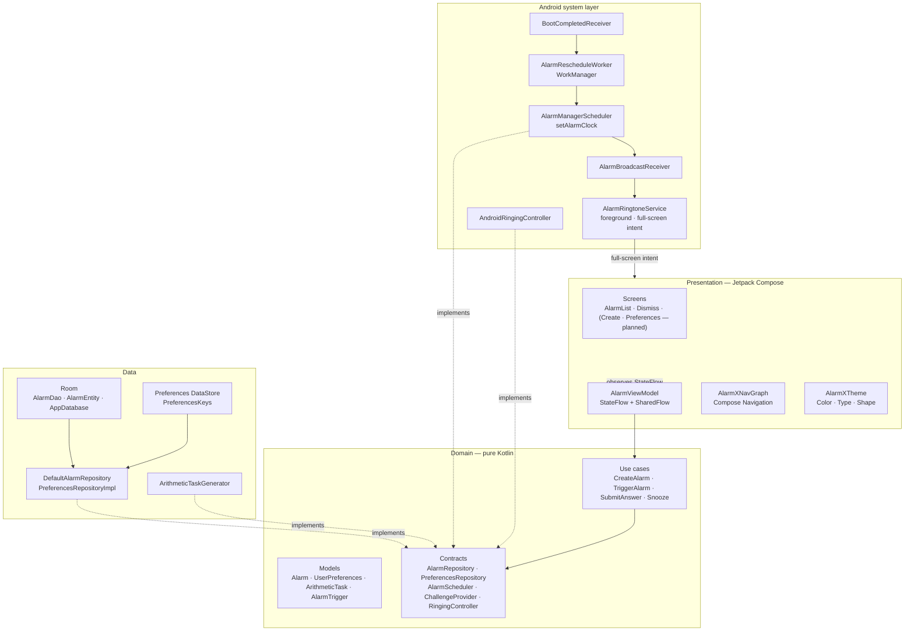
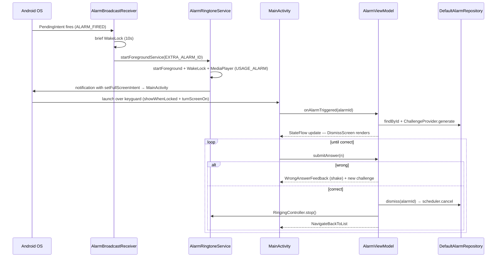

# AlarmX

> An Android alarm clock that **forces you to think before it shuts up.**
> Solve a quick arithmetic challenge to dismiss it — no swipe-to-snooze, no muscle-memory cheating.

<p align="left">
  
  
  
  
  
  
  
  
  
  
</p>

<!-- Replace the placeholder paths below with real screenshots once you've taken them. -->
<p align="left">
  
</p>

---

## Why AlarmX?

Every other alarm app fails the same test: **you can dismiss it half-asleep**. AlarmX makes that impossible. When the alarm fires:

1. Your screen turns on **over the lock screen** — even at 06:30 in deep Doze.
2. The default alarm ringtone plays at full volume on the alarm stream.
3. A full-screen UI shows the time, an arithmetic problem, and a numeric keypad.
4. **Wrong answer?** The screen shakes and a fresh problem appears — you can't memorise.
5. **Right answer?** The ringtone stops, the alarm is dismissed.

The visual language is borrowed from [AppBlock](https://appblock.app/) — strict black / white / hairline-blue. No shadows, no fluff, no ads. One job, done very well.

---

## Features

- **Cognitive dismissal** — three difficulty levels (`EASY`, `MEDIUM`, `HARD`) with non-negative results, ≤ 4-digit operands, and at most 3-digit answers. The challenge regenerates on every wrong attempt.
- **Doze-bypassing exact alarms** — built on `AlarmManager.setAlarmClock`, the canonical user-facing API. Fires through Doze and app-standby, exempt from `SCHEDULE_EXACT_ALARM` runtime grants for alarm-clock category apps.
- **Lock-screen takeover** — `setShowWhenLocked` + `setTurnScreenOn` + a `setFullScreenIntent` notification mean the dismiss UI appears immediately, even on a locked, screen-off device.
- **Foreground ringtone service** — looping `MediaPlayer` on `USAGE_ALARM`, partial WakeLock with a 10-minute hard cap, `mediaPlayback` foreground type for API 34+.
- **Survives reboot** — `BootCompletedReceiver` enqueues a WorkManager `CoroutineWorker` that re-arms every enabled future alarm on `BOOT_COMPLETED`, app upgrade, time-zone change, or time-set.
- **AppBlock-style design system** — a single chromatic accent (`#2F6BFF` light, `#5B8CFF` dark), tabular monospaced numerics, hairline 1-px separators, zero elevation everywhere.
- **Reactive state** — single `AlarmViewModel` with `StateFlow<AlarmUiState>` and a `SharedFlow<AlarmEvent>` for navigation and haptic events.
- **Clean architecture** — domain layer is pure Kotlin (no Android imports), unit-testable on the JVM. System layer is a thin shell over `AlarmManager` / `Service` / `WorkManager`.

---

## Screenshots

> Placeholder — replace with real captures after running the app.

| Alarm list | Dismiss (locked screen) | Wrong answer (shake) | Empty state |
|---|---|---|---|
|  |  |  |  |

---

## Tech stack

| Area | Choice |
|---|---|
| Language | **Kotlin 2.2.10** (KSP `2.2.10-2.0.2`) |
| UI | **Jetpack Compose** (BOM `2024.09.00`) + **Material 3** |
| Navigation | `androidx.navigation:navigation-compose` `2.8.4` |
| Async | Kotlin Coroutines `1.9.0`, `Flow` / `StateFlow` / `SharedFlow` |
| State | `androidx.lifecycle` `2.10.0` (`viewmodel-compose`, `runtime-compose`) |
| Persistence | **Room** `2.7.0` (KSP) + **Preferences DataStore** `1.1.1` |
| Background | **WorkManager** `work-runtime-ktx` `2.10.0` |
| Scheduling | `AlarmManager.setAlarmClock` (with `setExactAndAllowWhileIdle` fallback) |
| Foreground audio | `MediaPlayer` + foreground service (`mediaPlayback`) |
| Build | AGP `9.1.1`, Java 11 source/target, core-library desugaring (`desugar_jdk_libs 2.1.5`) for `java.time` on min-SDK 24 |
| DI | **Hilt** (`com.google.dagger.hilt.android 2.54`), `hilt-navigation-compose`, `hilt-work` |
| Min / target SDK | 24 / 36 |

---

## Architecture

AlarmX follows **MVVM + Repository + Clean-Architecture-lite**. Android dependencies sit at the edges; the domain is pure Kotlin and unit-testable on the JVM.



### The "money flow" — alarm fires → cognitive dismissal



---

## Project structure

```
app/src/main/java/com/example/mytest/
├── AlarmXApp.kt                # Application — @HiltAndroidApp, Configuration.Provider for WorkManager
├── MainActivity.kt             # Single Activity (@AndroidEntryPoint), lock-screen takeover, intent routing
├── di/
│   ├── DataModule.kt           # @Provides: AppDatabase, AlarmDao, DataStore
│   ├── DomainModule.kt         # @Provides: Random
│   └── RepositoryModule.kt     # @Binds: repositories, scheduler, ringing controller, challenge provider
├── domain/                     # Pure Kotlin — no Android imports
│   ├── model/                  #   Alarm, UserPreferences, ArithmeticTask, DifficultyLevel
│   ├── repository/             #   AlarmRepository, PreferencesRepository
│   ├── scheduler/              #   AlarmScheduler
│   ├── challenge/              #   ChallengeProvider + ArithmeticTaskGenerator
│   ├── ringing/                #   RingingController
│   └── usecase/                #   CreateAlarm, TriggerAlarm, SubmitAnswer, Snooze
├── data/
│   ├── db/                     #   Room: AlarmEntity, AlarmDao, AppDatabase, converters, mapper
│   ├── prefs/                  #   PreferencesKeys, PreferencesRepositoryImpl
│   └── repository/             #   DefaultAlarmRepository (DAO + scheduler in lock-step)
├── system/
│   ├── alarm/                  #   AlarmIntents, AlarmManagerScheduler, AlarmBroadcastReceiver,
│   │                           #   AlarmRingtoneService, AndroidRingingController
│   └── boot/                   #   BootCompletedReceiver, AlarmRescheduleWorker
└── ui/
    ├── theme/                  #   Color, Type, Theme — AppBlock palette
    ├── common/                 #   AxToggle, AxPrimaryButton, AxSecondaryButton,
    │                           #   AxAlarmRow, AxNumberPad
    ├── alarm/
    │   ├── AlarmUiState.kt     #   §4.3 state model
    │   ├── AlarmEvent.kt       #   one-shot navigation/haptic events
    │   ├── AlarmViewModel.kt   #   single shared ViewModel
    │   ├── list/               #   AlarmListScreen
    │   └── dismiss/            #   DismissScreen (with shake animation)
    └── nav/                    #   AlarmXNavGraph
```

---

## Getting started

**This project requires Android Studio.** It cannot be built from a plain JDK.

➡ **Beginner-friendly walkthrough:** [`docs/ANDROID_STUDIO_SETUP.md`](docs/ANDROID_STUDIO_SETUP.md)

The guide covers, step by step:

1. Which version of Android Studio to install.
2. How to open the project (`File → Open`, never drag-and-drop).
3. Reading the Gradle sync indicators and waiting for it to finish.
4. Creating an Android emulator (AVD) **or** connecting a physical device over USB / Wi-Fi.
5. Pressing **Run ▶** and picking a device.
6. Granting the runtime permissions the app needs (`POST_NOTIFICATIONS`, exact alarms, full-screen intent).
7. **Troubleshooting** — JDK mismatch, Gradle sync failures, KSP errors, and more.

---

## Roadmap

- [ ] Permission UX (Settings deep-link for `SCHEDULE_EXACT_ALARM` denial, `USE_FULL_SCREEN_INTENT` "Manage" screen on API 34+).
- [ ] Direct-Boot-aware DB so alarms can re-arm before unlock on `LOCKED_BOOT_COMPLETED`.
- [ ] Unit tests for `ArithmeticTaskGenerator`, use cases, and `AlarmViewModel`.
- [ ] Wear OS companion + Quick Settings tile.

---

## License

MIT — see [`LICENSE`](LICENSE) (add a license file if you intend to publish).
